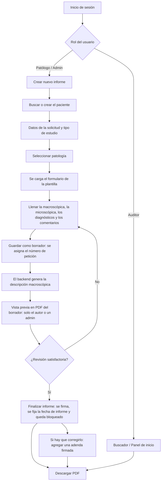

# 🔬 PathoLab — Sistema de Gestión de Informes de Anatomía Patológica

[](https://www.djangoproject.com/)
[](https://www.django-rest-framework.org/)
[](https://react.dev/)
[](https://vitejs.dev/)
[](https://jwt.io/)

**PathoLab** es una plataforma web para capturar, generar, gestionar y auditar informes histopatológicos. El patólogo llena un formulario estructurado según el tipo de muestra. El sistema redacta automáticamente la descripción macroscópica en lenguaje natural y genera el informe en PDF. Además, incluye un foro para que los patólogos compartan casos y observaciones.

---

## Tabla de Contenidos

- [Características Principales](#características-principales)
- [Roles y Permisos](#roles-y-permisos)
- [Arquitectura y Tecnologías](#arquitectura-y-tecnologías)
- [Estructura del Proyecto](#estructura-del-proyecto)
- [Requisitos Previos](#requisitos-previos)
- [Instalación y Configuración Local](#instalación-y-configuración-local)
- [Arrancar el Proyecto](#arrancar-el-proyecto)
- [Usuarios y Cuentas de Prueba](#usuarios-y-cuentas-de-prueba)
- [Pruebas Automáticas](#pruebas-automáticas)
- [Formato y Linter](#formato-y-linter)
- [Catálogo de Patologías Incluidas](#catálogo-de-patologías-incluidas)
- [Referencia de la API REST](#referencia-de-la-api-rest)
- [Flujo de Trabajo del Informe](#flujo-de-trabajo-del-informe)
- [Seguridad](#seguridad)
- [Documentación del Proyecto](#documentación-del-proyecto)
- [Hoja de Ruta (Roadmap)](#hoja-de-ruta-roadmap)

---

## Características Principales

- **14 patologías preconfiguradas**: cada tipo de muestra tiene su propio formulario y su protocolo médico.
- **Formularios dinámicos**: los campos (texto, número, lista desplegable, área de texto, sí/no) se generan según la patología elegida. Los campos obligatorios se validan en el frontend y en el backend (0 y "No" cuentan como respuestas válidas).
- **Descripción macroscópica automática**: al guardar un informe, el backend convierte los datos del formulario en un párrafo redactado en lenguaje natural.
- **Número de petición automático**: al crear un informe, el sistema le asigna un número `P-AÑO-NNNNN` (por ejemplo `P-2026-00045`). El consecutivo vuelve a 1 cada año, no se repite aunque varios usuarios guarden a la vez y no se reutiliza si se borra un borrador. Se puede anotar, de forma opcional, el número de orden de la institución remitente.
- **Exportación a PDF**: genera con **ReportLab** un informe con la estructura de un informe real de anatomía patológica:
  - encabezado con el nombre, la dirección y el teléfono del laboratorio, que se configuran en `backend/.env` (por defecto, el de demostración: "PathoLab — Laboratorio de Patología (demostración)", "Santiago de Cali, Colombia", sin teléfono);
  - tabla de datos en dos columnas: paciente, identificación, edad (a la fecha de ingreso), sexo, médico tratante, EPS, servicio, número de petición, fechas de ingreso y de informe, orden externa (si existe) y estudios solicitados;
  - título "INFORME DE ANATOMÍA PATOLÓGICA", tipo de estudio, patología y tipo de muestra;
  - descripción macroscópica, descripción microscópica, diagnósticos numerados con su código CIE-10 y comentarios;
  - firma del autor (nombre, especialidad y registro médico);
  - adendas al final, cada una con su firma, y un aviso bajo el título ("Este informe tiene 2 adendas; ver al final") para que nadie lea el diagnóstico original sin saber que se corrigió;
  - pie en cada página con el número de petición, "Página X de Y" y la hora de generación.

  Un informe finalizado imprime los datos congelados al finalizar. El PDF de un borrador es solo una **vista previa** para su autor o un administrador: no lleva firma, tiene una marca de agua "BORRADOR" en cada página, dice "BORRADOR — SIN VALIDEZ" en la fecha de informe y en el pie, y el archivo termina en `_borrador.pdf`.
- **Informes finalizados bloqueados**: un informe finalizado ya no se puede editar ni borrar desde la aplicación.
- **No perder lo escrito**: si hay cambios sin guardar, salir del informe o cerrar sesión pide confirmar (seguir editando, salir sin guardar o guardar y salir). Finalizar y la vista previa del PDF guardan primero lo que hay en pantalla. Un borrador que ya existe se guarda solo, 5 segundos después del último cambio, y un indicador muestra si está guardado. Un informe nuevo no se guarda solo, para no gastar números de petición. Nada se guarda en el navegador.
- **Adendas**: un informe finalizado se corrige con adendas, sin modificar lo que ya se entregó. Cada adenda lleva motivo, texto, número (1, 2, 3... dentro del informe), fecha y la firma de quien la crea, que debe tener registro médico. Las agrega el autor del informe o un administrador, y no se editan ni se borran.
- **Firma y finalización**: el informe lo firma siempre su autor, con su nombre, especialidad y registro médico. El registro médico solo lo asigna un administrador. Para finalizar, el informe debe tener paciente y al menos un diagnóstico, el autor debe tener registro médico y, en histología, debe haber descripción microscópica; si falta algo, la aplicación dice qué. Al finalizar se fija la fecha de informe y se congelan los datos del paciente, la EPS, el servicio y la firma: corregirlos después no cambia un informe ya entregado.
- **Catálogo administrable**: patologías agrupadas por categorías, y plantillas de campos editables. Una patología se puede desactivar: deja de ofrecerse en los informes nuevos sin perder el historial.
- **Pacientes**: registro de los pacientes con su documento, nombres, fecha de nacimiento, sexo y EPS. La edad se calcula a partir de la fecha de nacimiento: en años, o en meses o días si el paciente es menor de 1 año. Se buscan por documento, nombres o apellidos, y cada paciente muestra su historial de informes. Solo se guardan los datos que aparecen en el informe.
- **Datos de la solicitud**: cada informe tiene su paciente (se busca o se crea desde el mismo formulario), médico tratante, fecha de ingreso, EPS, servicio, estudios solicitados y tipo de estudio (histología, citología, inmunohistoquímica, etc.). La EPS se guarda en el informe, porque el paciente puede cambiar de EPS. La edad del paciente se calcula a la fecha de ingreso, así que no cambia si el informe se reimprime años después.
- **Contenido del informe**: descripción microscópica, diagnósticos y comentarios. Los diagnósticos son una lista ordenada (se agregan, quitan, suben y bajan), con un código CIE-10 opcional que se valida y se normaliza (`c443` se guarda como `C44.3`). No se carga el catálogo oficial de la CIE-10.
- **Catálogos de EPS y servicios**: se administran en la pantalla Catálogos. Lo que ya no se usa se desactiva en lugar de borrarse.
- **Búsqueda y filtros**: por número de petición, nombre o documento del paciente, número de orden externa, patología o tipo de muestra, rango de fechas y estado. Resultados paginados de 20 en 20.
- **Panel de inicio**: totales de informes (todos, borradores y finalizados) y los 10 más recientes.
- **Foro de patólogos**: publicaciones por temas (los patólogos y administradores pueden crear temas nuevos), con hasta 6 imágenes (máximo 10 MB cada una) y comentarios. Un administrador puede fijar publicaciones importantes.
- **Perfil de usuario**: edición de datos personales y cambio de contraseña. El registro médico se ve en solo lectura, y un patólogo sin registro ve un aviso de que no podrá finalizar informes.

---

## Roles y Permisos

| Acción | Administrador | Patólogo | Auditor |
|---|:---:|:---:|:---:|
| Ver informes, buscar y descargar el PDF de un informe finalizado | Sí | Sí | Sí |
| Descargar la vista previa en PDF de un borrador | Sí (cualquiera) | Solo los suyos | No |
| Crear informes | Sí | Sí | No |
| Editar, borrar o finalizar un informe | Sí (cualquiera) | Solo los suyos | No |
| Editar o borrar un informe **finalizado** | No | No | No |
| Agregar adendas a un informe finalizado (con registro médico) | Sí (cualquiera) | Solo a los suyos | No |
| Administrar patologías, plantillas, categorías y temas del foro | Sí | Sí | No |
| Ver pacientes | Sí | Sí | Sí |
| Crear y editar pacientes; administrar EPS y servicios | Sí | Sí | No |
| Borrar pacientes (solo si no tienen informes) | Sí | No | No |
| Publicar y comentar en el foro | Sí | Sí | No (solo lectura) |
| Editar o borrar publicaciones y comentarios | Sí (moderación) | Solo los suyos | No |
| Fijar publicaciones del foro | Sí | No | No |
| Registrar usuarios y ver la lista de usuarios | Sí | No | No |
| Editar su perfil y cambiar su contraseña | Sí | Sí | Sí |

Estas reglas responden a decisiones del proyecto registradas en [`docs/decisiones.md`](docs/decisiones.md):
- **D-1:** los patólogos también administran el catálogo.
- **D-2:** solo el autor o un administrador modifica un informe.
- **D-3:** un informe finalizado no se modifica, ni siquiera por un administrador.
- **D-8:** el registro médico solo lo asigna un administrador, y el informe lo firma siempre su autor.
- **D-9:** un informe finalizado se corrige con adendas, que no se editan ni se borran.
- **D-11:** patólogos y administradores crean y editan pacientes y administran EPS y servicios; solo un administrador borra pacientes.
- **D-12:** el PDF de un borrador es una vista previa solo para su autor o un administrador.
- **D-13:** aviso al salir con cambios sin guardar y autoguardado de los borradores existentes (nunca de los informes nuevos ni en el navegador).
- **D-14:** un informe finalizado tampoco se modifica desde el panel `/admin/`: ahí un informe finalizado es de solo lectura y no se puede borrar. *Pendiente de implementar en la fase 4 del plan.*
- **D-15:** el encabezado del PDF (datos del laboratorio) también se congela al finalizar.

Un informe finalizado se corrige **siempre** agregándole una adenda. No hay otra vía: según la decisión D-14 (2026-10-08), que reemplaza la excepción de `/admin/` de D-3, tampoco se modifica desde el panel de Django.

> **Pendiente:** hoy `/admin/` todavía permite cambiar un informe finalizado (solo las adendas y los datos congelados son de solo lectura). Se bloquea en la fase 4 de [`docs/plan-calidad-y-diseno.md`](docs/plan-calidad-y-diseno.md).

---

## Arquitectura y Tecnologías

```
┌────────────────────────────────────────────────────────┐
│                   Cliente (Navegador)                  │
│             React 18 + Vite + React Router             │
└──────────────────────────┬─────────────────────────────┘
                           │ HTTP / JSON (Axios)
                           │ Token JWT en la cabecera Authorization
┌──────────────────────────▼─────────────────────────────┐
│                API REST (Django + DRF)                 │
│ ┌───────────┐ ┌──────────────┐ ┌──────────┐ ┌────────┐ │
│ │ accounts  │ │  informes    │ │pacientes │ │  foro  │ │
│ │- Login JWT│ │- Patologías  │ │- Pacien- │ │- Temas │ │
│ │- Roles    │ │- Plantillas  │ │  tes     │ │- Publi-│ │
│ │- Perfil   │ │- Servicios   │ │- EPS     │ │  cacio-│ │
│ │- Registro │ │- Informes    │ │- Histo-  │ │  nes   │ │
│ │  médico   │ │- Diagnósticos│ │  rial    │ │- Imáge-│ │
│ │- Usuarios │ │- Adendas     │ │          │ │  nes   │ │
│ │           │ │- PDF         │ │          │ │- Comen-│ │
│ │           │ │  (ReportLab) │ │          │ │  tarios│ │
│ └───────────┘ └──────────────┘ └──────────┘ └────────┘ │
└──────────────────────────┬─────────────────────────────┘
                           │ ORM
┌──────────────────────────▼─────────────────────────────┐
│          Base de datos (SQLite / PostgreSQL)           │
└────────────────────────────────────────────────────────┘
```

- **Backend**:
  - Python 3.10+
  - Django 4.2 LTS
  - Django REST Framework 3.14+
  - SimpleJWT (tokens de acceso de 8 horas y de renovación de 7 días, con rotación)
  - django-cors-headers
  - python-decouple (configuración desde `.env`)
  - ReportLab (PDF) y Pillow (validación de imágenes)
  - SQLite en desarrollo; PostgreSQL si se define `DB_NAME` en el `.env`
  - Ruff (formato y linter, solo en desarrollo)
- **Frontend**:
  - React 18 y React Router 6 (router de datos: `createBrowserRouter`)
  - Vite 6.4
  - Axios (añade el token JWT a cada petición y lo renueva automáticamente si vence)
  - Estilos propios en `src/index.css`, sin librería de componentes
  - Pruebas con Vitest 5 y React Testing Library
  - Prettier (formato) y ESLint (errores y malas prácticas), solo en desarrollo

---

## Estructura del Proyecto

```
patologia-app/
├── backend/
│   ├── accounts/              # Usuarios, roles, login JWT, perfil y contraseñas
│   │   ├── models.py          # Modelo Usuario con rol (admin, patologo, auditor)
│   │   ├── permissions.py     # Permisos: EsAdmin, EsPatologoOAdmin, EsPatologoOAdminYSoloAdminBorra, EsAutorOAdminOSoloLectura
│   │   ├── serializers.py     # Perfil, registro y cambio de contraseña (con validadores)
│   │   ├── throttles.py       # Límites de intentos de login y de registro
│   │   ├── views.py / urls.py # Endpoints /api/auth/
│   │   └── tests.py
│   ├── config/
│   │   ├── settings.py        # Configuración (lee el .env), JWT, CORS, límites de peticiones
│   │   ├── urls.py            # Rutas principales
│   │   ├── paginacion.py      # Paginación (20 por página, ?page_size= hasta 1000)
│   │   ├── catalogos.py       # Piezas comunes de los catálogos de EPS y servicios
│   │   ├── test_runner.py     # Ejecutor de pruebas (sin límites de peticiones acumulados)
│   │   └── tests.py           # Pruebas de la configuración (SECRET_KEY y DEBUG)
│   ├── informes/
│   │   ├── management/commands/seed_data.py  # Datos iniciales: usuarios, 14 patologías, temas, servicios, EPS y 2 pacientes ficticios
│   │   ├── models.py          # Categoria, Patologia, Plantilla, Servicio, ConsecutivoPeticion, Informe, Diagnostico, Adenda
│   │   ├── serializers.py
│   │   ├── admin.py           # Panel /admin/ (número de petición, datos congelados y adendas en solo lectura)
│   │   ├── utils.py           # Generador de la descripción macroscópica y del PDF
│   │   ├── views.py / urls.py # Endpoints /api/ (catálogo, servicios, opciones, informes, finalizar, adendas, PDF)
│   │   └── tests.py
│   ├── pacientes/
│   │   ├── models.py          # Paciente (con la edad calculada), EPS y listas fijas de sexo y tipo de documento
│   │   ├── serializers.py
│   │   ├── views.py / urls.py # Endpoints /api/pacientes/ (con el historial de informes)
│   │   └── tests.py
│   ├── foro/
│   │   ├── models.py          # TemaForo, Publicacion, ImagenPublicacion, Comentario
│   │   ├── serializers.py
│   │   ├── views.py / urls.py # Endpoints /api/foro/
│   │   └── tests.py
│   ├── manage.py
│   ├── requirements.txt       # Dependencias de producción
│   ├── requirements-dev.txt   # Las de producción más Ruff (formato y linter)
│   ├── ruff.toml              # Configuración de Ruff
│   └── .env.example           # Plantilla del .env (SECRET_KEY obligatoria)
├── frontend/
│   ├── src/
│   │   ├── api/client.js      # Cliente Axios: dirección de la API (VITE_API_URL) y token JWT
│   │   ├── context/AuthContext.jsx  # Sesión y rol del usuario
│   │   ├── components/        # Navbar, Footer, FormularioPaciente, CeldaPaciente, EstadoBadge
│   │   │   └── informe/       # Partes del informe: SelectorPaciente, DatosSolicitud, ListaDiagnosticos, SeccionFirma y SeccionAdendas
│   │   ├── hooks/useOpciones.js  # Listas fijas de /api/opciones/ (se piden una vez)
│   │   ├── utils/formularios.js  # hoyISO() y conOpcionActual() (catálogos desactivados)
│   │   ├── pages/             # Login, Dashboard, Informe, Buscar, Pacientes, Patologías, Catálogos,
│   │   │                      # Foro, Detalle de publicación, Perfil y páginas legales
│   │   ├── test/setup.js      # Configuración de las pruebas
│   │   ├── App.jsx            # Rutas (protegidas, públicas y legales)
│   │   └── index.css          # Estilos globales
│   ├── package.json
│   ├── .prettierrc            # Configuración de Prettier (formato)
│   ├── eslint.config.js       # Configuración de ESLint (errores y malas prácticas)
│   ├── vite.config.js         # Proxy /api → backend y configuración de Vitest
│   └── .env.example           # Plantilla del .env (VITE_API_URL)
├── docs/                      # Auditoría, decisiones, propuesta del informe v2 y estado del trabajo
├── CHANGELOG.md               # Registro de cambios
├── scripts/                   # "npm run dev" (comprobaciones y arranque) y "npm run check" (formato y linter)
├── .vscode/                   # Formato al guardar y extensiones recomendadas para VS Code
├── .git-blame-ignore-revs     # Commits de solo formato que git blame debe saltar
├── package.json               # Comandos de la raíz (npm run dev, npm run check, npm test)
├── CLAUDE.md                  # Guía para el asistente de código
└── PathoLab_API.postman_collection.json
```

Las pruebas del frontend están junto a cada componente, en archivos `*.test.jsx`.

---

## Requisitos Previos

- **Python** 3.10 o superior ([python.org](https://www.python.org/))
- **Node.js** 22.12 o superior y **npm** ([nodejs.org](https://nodejs.org/)). Vite funciona con versiones anteriores, pero Vitest 5 (las pruebas) necesita Node 22.12+.
- **Git** ([git-scm.com](https://git-scm.com/))

---

## Instalación y Configuración Local

### 1. Clonar el repositorio

```bash
git clone https://github.com/juansalamanca01-glitch/patologia-app.git
cd patologia-app
```

### 2. Backend (Django)

1. **Entra en la carpeta del backend:**
   ```bash
   cd backend
   ```

2. **Crea y activa un entorno virtual:**
   ```powershell
   # Windows (PowerShell)
   python -m venv venv
   .\venv\Scripts\Activate.ps1
   ```
   ```bash
   # Linux / macOS
   python3 -m venv venv
   source venv/bin/activate
   ```

3. **Instala las dependencias:**
   ```bash
   pip install -r requirements-dev.txt
   ```
   `requirements-dev.txt` instala las dependencias de producción (`requirements.txt`) más Ruff, la herramienta de formato y linter. En un servidor basta con `pip install -r requirements.txt`.

4. **Crea el archivo `.env` (obligatorio):**
   ```bash
   copy .env.example .env     # Windows
   # cp .env.example .env     # Linux/macOS
   ```
   Luego genera una clave secreta propia y pégala en `SECRET_KEY=` dentro de `.env`:
   ```bash
   python -c "import secrets; print(secrets.token_urlsafe(50))"
   ```
   > Sin `SECRET_KEY` el backend no arranca. Si no se define `DEBUG`, queda en `False` (modo producción). El `.env.example` trae `DEBUG=True` para desarrollo.

   **Encabezado del PDF (opcional):** el nombre, la dirección y el teléfono del laboratorio se leen de `.env`:

   | Variable | Qué imprime | Si no se define |
   |---|---|---|
   | `LABORATORIO_NOMBRE` | Primera línea, en negrita | "PathoLab — Laboratorio de Patología (demostración)" |
   | `LABORATORIO_DIRECCION` | Segunda línea: dirección completa y ciudad | "Santiago de Cali, Colombia" |
   | `LABORATORIO_TELEFONO` | Tercera línea, "Teléfono: …" | No se imprime la línea |

   Después de cambiarlas, reinicia el backend. El `.env` se guarda en UTF-8, así que admite tildes y la raya (—). El cambio afecta a los borradores y a los informes que se finalicen después. Un informe finalizado conserva el encabezado que tenía al finalizarse (decisión D-15).

5. **Aplica las migraciones:**
   ```bash
   python manage.py migrate
   ```

6. **Carga los datos iniciales:**
   ```bash
   python manage.py seed_data
   ```
   Crea los usuarios de prueba, las 14 patologías con sus plantillas, 4 temas para el foro (*Casos clínicos*, *Técnicas de laboratorio*, *Investigación* y *Dudas y consultas*), 7 servicios, 12 EPS y 2 pacientes ficticios. Se puede ejecutar varias veces sin duplicar datos. No crea categorías ni informes: las categorías se crean desde la pantalla Patologías.

7. **Inicia el servidor:**
   ```bash
   python manage.py runserver
   ```
   El backend queda disponible en http://127.0.0.1:8000/ y el panel de administración en http://127.0.0.1:8000/admin/.

### 3. Frontend (React + Vite)

Abre una **segunda terminal** en la raíz del proyecto:

1. **Entra en la carpeta del frontend:**
   ```bash
   cd frontend
   ```

2. **Instala las dependencias:**
   ```bash
   npm install
   ```

3. **Crea el archivo `.env`:**
   ```bash
   copy .env.example .env     # Windows
   # cp .env.example .env     # Linux/macOS
   ```
   En desarrollo deja `VITE_API_URL` **vacía**. El archivo `.env.example` explica cuándo hay que darle un valor.

4. **Inicia el servidor de desarrollo:**
   ```bash
   npm run dev
   ```
   La aplicación queda disponible en http://localhost:5173/.

> [!NOTE]
> El frontend llama a la API con rutas relativas (`/api/...`). En desarrollo, el proxy de `vite.config.js` las reenvía al backend en `http://localhost:8000`. En producción hay dos opciones:
> - el mismo servidor web sirve el frontend y el backend, y `VITE_API_URL` queda vacía;
> - o se compila con `VITE_API_URL=https://dirección-del-backend`.

### 4. Herramientas de la raíz

En la **raíz** del proyecto (una sola vez):
```bash
npm install
```

---

## Arrancar el Proyecto

Una vez hecha la instalación, para trabajar cada día basta **un solo comando** desde la raíz del proyecto:

```bash
npm run dev
```

- Arranca el backend (http://localhost:8000) y el frontend (http://localhost:5173) en la misma terminal. Cada línea lleva la etiqueta `[backend]` o `[frontend]`.
- Abre la aplicación en **http://localhost:5173**.
- **Ctrl + C** detiene los dos servidores. Si uno de los dos se cae, el otro también se detiene.
- Antes de arrancar, comprueba que estén el entorno virtual, `backend/.env` y las dependencias del frontend. Si falta algo, dice qué comando ejecutar. También avisa si hay migraciones sin aplicar (pasa al traer cambios de otro computador): en ese caso, ejecuta `cd backend` y luego `python manage.py migrate`.

También se pueden arrancar por separado, en dos terminales: `python manage.py runserver` en `backend/` y `npm run dev` en `frontend/`.

---

## Usuarios y Cuentas de Prueba

`python manage.py seed_data` crea un usuario de cada rol y un segundo patólogo:

| Usuario | Contraseña | Rol |
|---|---|---|
| `admin` | `admin1234` | **Administrador** (también tiene acceso a `/admin/`, donde puede crear usuarios y asignarles rol y registro médico) |
| `patologo1` | `patologo1234` | **Patólogo** (registro médico ficticio `RM-PRUEBA-0001`, para poder finalizar informes) |
| `patologo2` | `patologo2345` | **Patólogo** (registro médico ficticio `RM-PRUEBA-0002`). Sirve para probar que un patólogo no puede modificar, borrar ni finalizar los informes de otro (decisión D-2) |
| `auditor1` | `auditor1234` | **Auditor** |

Si un usuario ya existe, `seed_data` no lo cambia (salvo que `patologo1` no tenga registro médico: se le asigna `RM-PRUEBA-0001`).

Los permisos de cada rol están en [Roles y Permisos](#roles-y-permisos).

`seed_data` crea también 2 pacientes **ficticios** ("Paciente Ficticio Uno", documento `PRUEBA0001`, y "Prueba Apellido Dos", `PRUEBA0002`). Nunca se usan datos de pacientes reales: los documentos de prueba llevan el prefijo `PRUEBA` para que no coincidan con uno real.

> **Importante:** son contraseñas de **demostración**: no las uses en un servidor real. Además, la API rechaza contraseñas así de débiles cuando se registra un usuario o se cambia una contraseña, porque aplica los validadores de Django.

---

## Pruebas Automáticas

```bash
# Backend (desde backend/, con el entorno virtual activado)
python manage.py test                     # todas las pruebas
python manage.py test informes            # las de una app

# Frontend (desde frontend/)
npm test                                  # todas las pruebas, una vez
npm run test:watch                        # se repiten al guardar cambios

# Comprobaciones de "npm run dev" y "npm run check" (desde la raíz)
npm test
```

- **Backend:** cubre el número de petición (formato, reinicio por año, creación simultánea desde varios hilos y numeración de los informes existentes al migrar), los permisos por rol, los pacientes (edad calculada, documento único, validaciones, búsqueda e historial), los datos de la solicitud del informe (paciente obligatorio, fecha de ingreso, EPS del momento del estudio, búsqueda por paciente), el contenido del informe (microscópica, comentarios, diagnósticos y validación del CIE-10), la finalización (requisitos, fecha de informe, firma del autor y datos congelados), las adendas (solo en finalizados, permisos, numeración, firma congelada, sin edición y en el PDF), quién puede descargar el PDF de un borrador y su marca de agua, el registro médico, los catálogos de EPS y servicios (y su borrado cuando están en uso), las opciones fijas (`/api/opciones/`), el bloqueo de informes finalizados, la validación de campos obligatorios y de contraseñas, el PDF, la paginación y estadísticas, la subida de imágenes y la configuración segura.
- **Frontend:** cubre el formulario del informe (paciente, datos de la solicitud, diagnósticos, firma, requisitos para finalizar, adendas y orden de las tarjetas), la página de pacientes y su historial, la pantalla de catálogos, los listados, la página de perfil, la exportación a PDF (y la vista previa de un borrador), el aviso al salir con cambios sin guardar y el autoguardado de los borradores (D-13), el cierre de sesión por `/salir`, las imágenes del foro y su visor, y la dirección de la API.

---

## Formato y Linter

El formato del código lo deciden herramientas, no cada persona, para que los cambios de una revisión sean solo cambios reales:

| Herramienta | Dónde | Qué hace |
|---|---|---|
| **Prettier** 3.9 | `frontend/` | Formato de JavaScript, JSX, CSS, HTML y JSON (comillas simples, punto y coma, líneas de hasta 120 caracteres) |
| **ESLint** 9 | `frontend/` | Errores y malas prácticas: variables sin usar, reglas de los hooks de React, etc. El formato lo deja a Prettier (`eslint-config-prettier`) |
| **Ruff** 0.16 | `backend/` | Formato (como Black, con comillas simples) y linter de Python: errores, orden de los imports, errores probables y buenas prácticas de Django. No revisa las migraciones |

Antes de hacer un commit, desde la raíz:
```bash
npm run check
```
Revisa las cuatro cosas (formato y linter de cada lado) sin cambiar ningún archivo, y termina con error si alguna falla. Para corregir el formato:
```bash
cd frontend && npm run format          # Prettier
cd backend && python -m ruff format .  # Ruff (con el entorno virtual activado)
```
También están `npm run lint` (frontend) y `python -m ruff check .` (backend, con `--fix` para los arreglos automáticos).

**VS Code:** el proyecto trae `.vscode/settings.json`, que formatea al guardar (Prettier en el frontend y Ruff en el backend), y `.vscode/extensions.json`, con las extensiones recomendadas. La primera vez que abras el proyecto, VS Code ofrecerá instalarlas:
- **Prettier** (`esbenp.prettier-vscode`);
- **ESLint** (`dbaeumer.vscode-eslint`);
- **Ruff** (`charliermarsh.ruff`).

Al guardar se usan las mismas versiones que `npm run check`: el Prettier de `frontend/node_modules` y el Ruff del entorno virtual del backend. Prettier solo formatea archivos de `frontend/`, así que no toca la documentación ni la colección de Postman.

**`git blame`:** el primer formateo cambió muchas líneas sin cambiar el código. `.git-blame-ignore-revs` le dice a `git blame` que salte ese commit, para que cada línea siga mostrando quién la escribió de verdad. GitHub lo usa solo; en tu copia local, actívalo una vez:
```bash
git config blame.ignoreRevsFile .git-blame-ignore-revs
```

---

## Catálogo de Patologías Incluidas

`seed_data` carga plantillas clínicas para 14 tipos de muestra:

1. **Biopsia de Piel**: localización, tipo de muestra (punch/escisional/incisional/shave), dimensiones, color, bordes y superficie.
2. **Biopsia de Mama**: lateralidad, tipo de muestra, dimensiones, peso, tamaño del tumor, márgenes, ganglios y necrosis.
3. **Apéndice Cecal**: longitud, diámetro, superficie serosa, consistencia y color.
4. **Vesícula Biliar**: dimensiones, espesor de la pared, mucosa y cálculos.
5. **Biopsia de Próstata**: número de cilindros, localización, longitud y PSA.
6. **Tiroides**: lateralidad, nódulos, cápsula, dimensiones y peso.
7. **Colon y Recto**: localización, morfología de la lesión, márgenes y ganglios.
8. **Útero y Cérvix**: dimensiones, miomas, grosor endometrial, cuello y anexos.
9. **Ganglio Linfático**: tipo de biopsia, localización, número, necrosis y cápsula.
10. **Biopsia Gástrica**: región, número de fragmentos y sospecha de *H. pylori*.
11. **Pulmón**: lateralidad, lóbulo, márgenes y compromiso pleural.
12. **Riñón**: nefrectomía o biopsia, tamaño del tumor, cápsula y vena renal.
13. **Amígdalas y Adenoides**: dimensiones, criptas, exudado y consistencia.
14. **Tejido Blando**: lesión sospechada, planos anatómicos y márgenes.

---

## Referencia de la API REST

Todas las rutas exigen la cabecera `Authorization: Bearer <token>`, excepto el login y la renovación del token. Los listados vienen **paginados de 20 en 20**: la respuesta trae `count`, `next`, `previous` y `results`, y se pide otra página con `?page=2`. Con `?page_size=` se puede pedir una página más grande, hasta 1000 elementos.

### Autenticación y usuarios (`/api/auth/`)

| Método | Endpoint | Descripción | Acceso |
|---|---|---|---|
| POST | `/api/auth/login/` | Iniciar sesión. Devuelve `access`, `refresh` y los datos del usuario | Público (máx. 10 intentos/min) |
| POST | `/api/auth/refresh/` | Renovar el token de acceso. Devuelve también un `refresh` nuevo; el anterior queda invalidado | Público |
| POST | `/api/auth/logout/` | Cerrar sesión: invalida el `refresh` enviado (`{"refresh": "..."}`) | Público (con el token de renovación) |
| GET / PATCH | `/api/auth/perfil/` | Ver o editar el perfil propio (nombre, email, teléfono, especialidad). El rol, el usuario y el registro médico no se pueden cambiar | Autenticado |
| POST | `/api/auth/cambiar-password/` | Cambiar la contraseña (`old_password`, `new_password`). Cierra las demás sesiones y devuelve tokens nuevos | Autenticado |
| POST | `/api/auth/registro/` | Crear un usuario con su rol y, si es patólogo, su `registro_medico` | Admin |
| GET | `/api/auth/usuarios/` | Listar usuarios | Admin |

### Catálogo (`/api/`)

| Método | Endpoint | Descripción | Acceso |
|---|---|---|---|
| GET / POST | `/api/categorias/` | Listar o crear categorías (`?search=`) | Leer: todos · Escribir: patólogo/admin |
| GET / PUT / PATCH / DELETE | `/api/categorias/{id}/` | Ver, editar o borrar una categoría (no se borra si tiene patologías) | Igual |
| GET / POST | `/api/patologias/` | Listar o crear patologías (`?categoria=`, `?search=`, `?activa=true`/`false`) | Igual |
| GET / PUT / PATCH / DELETE | `/api/patologias/{id}/` | Detalle con sus campos de plantilla. No se borra si tiene informes (400) | Igual |
| GET / POST | `/api/plantillas/` | Listar o crear campos de formulario (`?patologia=`) | Igual |
| GET / PUT / PATCH / DELETE | `/api/plantillas/{id}/` | Ver, editar o borrar un campo | Igual |
| GET / POST | `/api/servicios/` | Listar o crear servicios (`?search=`, `?activo=true`/`false`). El nombre no se puede repetir, sin importar mayúsculas ni espacios | Igual |
| GET / PUT / PATCH / DELETE | `/api/servicios/{id}/` | Ver, editar, desactivar (`activo: false`) o borrar un servicio | Igual |
| GET | `/api/opciones/` | Listas fijas: `sexos`, `tipos_documento` y `tipos_estudio`, cada una con `valor` y `etiqueta` | Todos |

### Pacientes (`/api/pacientes/`)

| Método | Endpoint | Descripción | Acceso |
|---|---|---|---|
| GET / POST | `/api/pacientes/eps/` | Listar o crear EPS (`?search=`, `?activa=true`/`false`). El nombre no se puede repetir, sin importar mayúsculas ni espacios | Leer: todos · Escribir: patólogo/admin |
| GET / PUT / PATCH / DELETE | `/api/pacientes/eps/{id}/` | Ver, editar, desactivar (`activa: false`) o borrar una EPS. Una EPS que usa algún paciente o informe no se borra (400): hay que desactivarla | Igual |
| GET / POST | `/api/pacientes/` | Listar (paginado, por apellidos) o crear pacientes. `?q=` busca por documento, nombres y apellidos; cada palabra debe aparecer en alguno de ellos | Leer: todos · Crear: patólogo/admin |
| GET / PUT / PATCH | `/api/pacientes/{id}/` | Ver o editar un paciente | Leer: todos · Editar: patólogo/admin |
| DELETE | `/api/pacientes/{id}/` | Borrar un paciente. Si tiene informes → 400 | Solo admin |
| GET | `/api/pacientes/{id}/informes/` | Historial de informes del paciente (paginado, con los campos del listado de informes) | Todos |

Cada paciente se devuelve con `edad` (calculada a la fecha de hoy; no se guarda) y `eps_nombre`. Reglas:
- El tipo y el número de documento no se pueden repetir. El número se guarda sin espacios ni puntos y en mayúsculas.
- La fecha de nacimiento no puede estar en el futuro ni ser de hace más de 130 años.
- La EPS es opcional. No se puede asignar una EPS desactivada, pero el paciente que ya la tenía la conserva.
- Solo se guardan los datos que aparecen en el informe: no se piden dirección, teléfono ni correo.

Las EPS y los servicios se desactivan en lugar de borrarse (decisión D-4), para que los informes antiguos los sigan mostrando. `seed_data` carga 7 servicios y 12 EPS (una lista corta de EPS reales más "Particular" y "Otra"), que se pueden editar.

### Informes (`/api/informes/`)

| Método | Endpoint | Descripción | Acceso |
|---|---|---|---|
| GET | `/api/informes/` | Listar informes, con `paciente_nombre`, `paciente_documento` y `tipo_estudio`. Filtros: `q` (número de petición, orden externa, patología, tipo de muestra, nombre o documento del paciente; cada palabra debe aparecer en alguno), `fecha_desde`, `fecha_hasta`, `estado`, `patologia`, `paciente` | Todos |
| POST | `/api/informes/` | Crear un informe y generar su descripción macroscópica. `paciente` (id) es obligatorio. El backend asigna `numero_peticion` (no se envía ni se puede cambiar). Si falta un campo obligatorio de la plantilla → 400 | Patólogo / Admin |
| GET | `/api/informes/estadisticas/` | Totales `{total, borradores, finalizados}`. Acepta los mismos filtros que el listado | Todos |
| GET | `/api/informes/{id}/` | Ver un informe completo | Todos |
| PUT / PATCH | `/api/informes/{id}/` | Editar un borrador (si está finalizado → 400) | Autor / Admin |
| DELETE | `/api/informes/{id}/` | Borrar un borrador (si está finalizado → 400) | Autor / Admin |
| POST | `/api/informes/{id}/finalizar/` | Finalizar el informe (después ya no se puede editar). Si faltan requisitos → 400 con `detail` y la lista `requisitos` | Autor / Admin |
| GET | `/api/informes/{id}/adendas/` | Adendas del informe, en orden | Todos |
| POST | `/api/informes/{id}/adendas/` | Agregar una adenda `{motivo, texto}` a un informe finalizado. En un borrador, o si quien la crea no tiene registro médico → 400. No hay PUT, PATCH ni DELETE | Autor / Admin |
| GET | `/api/informes/{id}/pdf/` | Descargar el informe en PDF. El de un borrador es una vista previa (marca de agua "BORRADOR", archivo `…_borrador.pdf`) solo para su autor o un admin; los demás reciben 403 | Todos (finalizado) / Autor y Admin (borrador) |

Datos de la solicitud del informe (etapa 4 del informe v2):
- `paciente` (id): obligatorio al crear y no se puede quitar después. Los informes de antes de esta etapa no tienen paciente y se muestran como "No registrado"; se les puede asignar uno al editarlos.
- `fecha_ingreso`: si no se envía, es hoy. No puede estar en el futuro ni ser anterior al nacimiento del paciente.
- `eps` y `servicio` (ids, opcionales). Si un informe nuevo no envía `eps`, toma la EPS actual del paciente, si sigue activa. No se puede asignar una EPS ni un servicio desactivados, pero el informe que ya los tenía los conserva.
- `medico_tratante`, `estudios_solicitados` y `numero_orden_externa`: texto, opcionales.
- `tipo_estudio`: uno de los valores de `tipos_estudio` en `/api/opciones/`. Por defecto, `histologia`.
- Al leer un informe llegan además `paciente_datos` (nombre, documento, fecha de nacimiento, sexo y edad **a la fecha de ingreso**), `eps_nombre` y `servicio_nombre`.

Contenido del informe (etapa 5 del informe v2):
- `descripcion_microscopica` y `comentarios`: texto, opcionales. `comentarios` reemplaza al antiguo `notas`, que ya no existe en la API; la migración conservó lo que estaba escrito.
- `diagnosticos`: lista de `{"descripcion": "...", "codigo_cie10": "C44.3"}` en el orden del informe (al leerla, cada uno trae también su `orden`). Si se envía, **reemplaza** a la lista anterior; si no se envía (por ejemplo, en un PATCH), no cambia. Máximo 20; la descripción no puede estar vacía.
- `codigo_cie10` es opcional. Se pasa a mayúsculas, se quitan los espacios y se agrega el punto si falta (`c443` → `C44.3`). Debe ser una letra, dos cifras y, si aplica, un punto con uno o dos caracteres (`C44`, `C44.3`, `M80.90`); si no → 400.
- Un borrador se puede guardar sin diagnósticos.

Firma y finalización (etapa 6 del informe v2):
- Para finalizar: el informe tiene paciente y al menos un diagnóstico, el autor tiene `registro_medico` (aunque finalice un admin, cuenta el del autor) y, si `tipo_estudio` es `histologia`, `descripcion_microscopica` no está vacía. Un borrador se puede guardar sin cumplirlos.
- `fecha_informe`: la fija `finalizar`; es `null` en un borrador. No se puede escribir por la API.
- `firma`: `{nombre, especialidad, registro_medico}` del autor.
- En un informe **finalizado**, `paciente_datos`, `eps_nombre`, `servicio_nombre` y `firma` salen de los datos congelados al finalizar, y no de los actuales. En un borrador son los actuales.

Adendas (etapa 8 del informe v2):
- Se envían `motivo` (máximo 300 caracteres) y `texto`, los dos obligatorios. El sistema pone `numero` (1, 2, 3... dentro del informe), `autor`, `fecha` y `firma` (`{nombre, especialidad, registro_medico}` de quien la crea, congelada en ese momento).
- Agregar una adenda no modifica el informe: su contenido, `fecha_informe` y los datos congelados siguen iguales.
- El detalle del informe (`GET /api/informes/{id}/`) trae la lista `adendas`; el listado no la trae. En `/admin/` las adendas se ven en solo lectura.

### Foro (`/api/foro/`)

| Método | Endpoint | Descripción | Acceso |
|---|---|---|---|
| GET / POST | `/api/foro/temas/` | Listar o crear temas | Leer: todos · Escribir: patólogo/admin |
| GET / PUT / PATCH / DELETE | `/api/foro/temas/{id}/` | Ver, editar o borrar un tema | Igual |
| GET / POST | `/api/foro/publicaciones/` | Listar (`?tema=`, `?search=`) o crear publicaciones | Leer: todos · Crear: patólogo/admin (máx. 10/min) |
| GET / PUT / PATCH / DELETE | `/api/foro/publicaciones/{id}/` | Ver (con imágenes y comentarios), editar o borrar. `fijado` solo lo cambia un admin | Autor / Admin |
| POST | `/api/foro/publicaciones/{id}/imagenes/` | Subir imágenes (campo `imagenes`, multipart). Máx. 6 por publicación y 10 MB cada una; deben ser imágenes reales | Autor / Admin |
| DELETE | `/api/foro/imagenes/{id}/` | Borrar una imagen | Autor de la publicación / Admin |
| GET / POST | `/api/foro/comentarios/` | Listar (`?publicacion=`) o crear comentarios (máx. 3000 caracteres) | Leer: todos · Crear: patólogo/admin (máx. 20/min) |
| GET / PUT / PATCH / DELETE | `/api/foro/comentarios/{id}/` | Editar o borrar un comentario. No se puede mover a otra publicación | Autor / Admin |

La colección [`PathoLab_API.postman_collection.json`](PathoLab_API.postman_collection.json) se puede importar en Postman para probar los endpoints principales.

---

## Flujo de Trabajo del Informe



---

## Seguridad

- **Autenticación JWT** con renovación automática. El token viaja siempre en la cabecera `Authorization`, nunca en la URL.
- **Cierre de sesión real**: al salir, al cambiar la contraseña y al renovar, el token de renovación anterior pasa a una lista negra y deja de servir. El token de acceso sigue siendo válido hasta que vence (máximo 8 horas), algo normal en JWT.
- **Permisos por rol y por autor** en el backend (ver [Roles y Permisos](#roles-y-permisos)). El frontend solo oculta botones; la regla real la aplica la API.
- **Límites de peticiones**:

  | Tipo de petición | Límite |
  |---|---|
  | Anónimas | 30/min |
  | Usuarios autenticados | 120/min |
  | Login | 10/min |
  | Registro | 5/min |
  | Publicaciones del foro | 10/min |
  | Comentarios del foro | 20/min |

- **Contraseñas** validadas con los validadores de Django: longitud mínima, que no sean comunes, que no sean solo números y que no se parezcan al usuario.
- **Configuración segura por defecto**: sin `SECRET_KEY` la app no arranca, y `DEBUG` es `False` si no se define. Con `DEBUG=False` se activan HTTPS, cookies seguras y HSTS, y CORS solo acepta los orígenes de `CORS_ALLOWED_ORIGINS`.
- **PDF**: el texto escrito por el usuario se escapa, así que no puede romper ni alterar el documento. El nombre del archivo solo lleva el número de petición, nunca datos del paciente. El PDF de un borrador solo lo descargan su autor o un administrador, con marca de agua "BORRADOR".
- **Integridad del informe**: un informe finalizado no se modifica (se corrige con adendas firmadas) y conserva los datos del paciente, la EPS, el servicio, la firma y el encabezado del laboratorio tal como estaban al finalizar (D-10, D-15).
- **Imágenes del foro**: se comprueban el tamaño y que sean imágenes reales.
- **Datos de pacientes**: son datos de salud, que la Ley 1581 de 2012 considera sensibles. Solo los ven usuarios con sesión y se guardan solo los que aparecen en el informe. La [política de privacidad](frontend/src/pages/PoliticaPrivacidadPage.jsx) de la aplicación (`/politica-privacidad`) lo explica. Antes de un uso real haría falta una revisión legal.

Para publicar la app en un servidor:
- Define una `SECRET_KEY` propia, `DEBUG=False`, `ALLOWED_HOSTS` y `CORS_ALLOWED_ORIGINS`.
- Configura en el servidor web un límite de tamaño de petición (por ejemplo, `client_max_body_size 60m;` en Nginx).
- Sirve la carpeta `media/`, porque Django solo la sirve en modo desarrollo.
- La búsqueda de pacientes (`?q=`) envía el nombre o el documento en la dirección de la petición. Configura los registros del servidor web para que no guarden esos parámetros, o protégelos como datos sensibles.

---

## Documentación del Proyecto

| Archivo | Contenido |
|---|---|
| [`CHANGELOG.md`](CHANGELOG.md) | Registro de cada cambio: fecha, qué se cambió y por qué |
| [`docs/auditoria-inicial.md`](docs/auditoria-inicial.md) | Auditoría del código, con el estado de cada hallazgo |
| [`docs/decisiones.md`](docs/decisiones.md) | Decisiones de diseño y de reglas de negocio |
| [`docs/propuesta-informe-v2.md`](docs/propuesta-informe-v2.md) | Diseño del informe de anatomía patológica v2 (pacientes, solicitud, diagnósticos, firma, PDF y adendas) |
| [`docs/plan-calidad-y-diseno.md`](docs/plan-calidad-y-diseno.md) | Plan por fases: herramientas de calidad, auditoría OWASP, guía de diseño y rediseño de la interfaz |
| [`docs/progreso.md`](docs/progreso.md) | Estado actual del trabajo, pendientes y próximos pasos |

---

## Hoja de Ruta (Roadmap)

- [ ] **Plantillas microscópicas e IHQ**: textos predefinidos para la descripción microscópica y la inmunohistoquímica (la descripción microscópica libre ya existe).
- [ ] **Catálogo CIE-10 y CIE-O**: autocompletado de los códigos de diagnóstico y de morfología tumoral.
- [ ] **Imágenes en los informes**: adjuntar microfotografías al informe y al PDF (hoy solo el foro admite imágenes).
- [x] **Encabezado del PDF configurable**: el nombre, la dirección y el teléfono del laboratorio se leen de `backend/.env` (`LABORATORIO_NOMBRE`, `LABORATORIO_DIRECCION`, `LABORATORIO_TELEFONO`). Hecho el 2026-10-08.
- [ ] **Imagen de la firma**: el administrador sube una imagen (PNG o JPG) de la firma del patólogo y el PDF la imprime sobre su nombre (etapa 10, opcional, de `docs/propuesta-informe-v2.md`).
- [ ] **Firma digital**: firma electrónica del patólogo con certificado o trazo digital. Hoy el informe lleva el nombre, la especialidad y el registro médico del autor, pero no es una firma criptográfica.
- [ ] **Integración HL7 / FHIR**: interoperabilidad con sistemas de información hospitalaria (HIS/LIS).
- [ ] **Registro de accesos**: guardar quién consulta qué informe o paciente y cuándo, incluidas las descargas del PDF. La historia clínica exige saber quién accedió a ella.
- [ ] **Contenedores Docker**: `Dockerfile` y `docker-compose.yml` para desplegar en un solo paso.

---

## Autor y Contacto

- **Proyecto**: PathoLab (patologia-app)
- **Desarrollado por**: Juan Salamanca ([@juansalamanca01-glitch](https://github.com/juansalamanca01-glitch))
- **Institución**: Unicatólica
