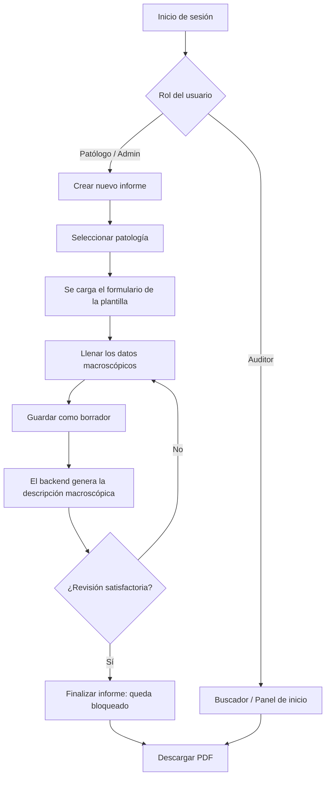

# 🔬 PathoLab — Sistema de Gestión de Informes de Patología Clínica

[](https://www.djangoproject.com/)
[](https://www.django-rest-framework.org/)
[](https://react.dev/)
[](https://vitejs.dev/)
[](https://jwt.io/)

**PathoLab** es una plataforma web para capturar, generar, gestionar y auditar informes histopatológicos. El patólogo llena un formulario estructurado según el tipo de muestra. El sistema redacta automáticamente la descripción macroscópica en lenguaje natural y genera el informe en PDF. Además, incluye un foro para que los patólogos compartan casos y observaciones.

---

## 📋 Tabla de Contenidos

- [Características Principales](#-características-principales)
- [Roles y Permisos](#-roles-y-permisos)
- [Arquitectura y Tecnologías](#️-arquitectura-y-tecnologías)
- [Estructura del Proyecto](#-estructura-del-proyecto)
- [Requisitos Previos](#-requisitos-previos)
- [Instalación y Configuración Local](#-instalación-y-configuración-local)
- [Usuarios y Cuentas de Prueba](#-usuarios-y-cuentas-de-prueba)
- [Pruebas Automáticas](#-pruebas-automáticas)
- [Catálogo de Patologías Incluidas](#-catálogo-de-patologías-incluidas)
- [Referencia de la API REST](#-referencia-de-la-api-rest)
- [Flujo de Trabajo del Informe](#-flujo-de-trabajo-del-informe)
- [Seguridad](#-seguridad)
- [Documentación del Proyecto](#-documentación-del-proyecto)
- [Hoja de Ruta (Roadmap)](#️-hoja-de-ruta-roadmap)

---

## ✨ Características Principales

- 🩺 **14 patologías preconfiguradas**: cada tipo de muestra tiene su propio formulario y su protocolo médico.
- 📝 **Formularios dinámicos**: los campos (texto, número, lista desplegable, área de texto, sí/no) se generan según la patología elegida. Los campos obligatorios se validan en el frontend y en el backend (0 y "No" cuentan como respuestas válidas).
- 🤖 **Descripción macroscópica automática**: al guardar un informe, el backend convierte los datos del formulario en un párrafo redactado en lenguaje natural.
- 📄 **Exportación a PDF**: genera con **ReportLab** un informe con título, número de caso, metadatos (fecha, patología, tipo de muestra, patólogo y estado), datos clínicos, descripción macroscópica y notas.
- 🔒 **Informes finalizados bloqueados**: un informe finalizado ya no se puede editar ni borrar desde la aplicación.
- 🗂️ **Catálogo administrable**: patologías agrupadas por categorías, y plantillas de campos editables. Una patología se puede desactivar: deja de ofrecerse en los informes nuevos sin perder el historial.
- 🔍 **Búsqueda y filtros**: por número de caso, patología o tipo de muestra, rango de fechas y estado. Resultados paginados de 20 en 20.
- 📊 **Panel de inicio**: totales de informes (todos, borradores y finalizados) y los 10 más recientes.
- 💬 **Foro de patólogos**: publicaciones por temas (los patólogos y administradores pueden crear temas nuevos), con hasta 6 imágenes (máximo 10 MB cada una) y comentarios. Un administrador puede fijar publicaciones importantes.
- 👤 **Perfil de usuario**: edición de datos personales y cambio de contraseña.

---

## 🔐 Roles y Permisos

| Acción | Administrador | Patólogo | Auditor |
|---|:---:|:---:|:---:|
| Ver informes, buscar y descargar PDF | ✅ | ✅ | ✅ |
| Crear informes | ✅ | ✅ | ❌ |
| Editar, borrar o finalizar un informe | ✅ (cualquiera) | Solo los suyos | ❌ |
| Editar o borrar un informe **finalizado** | ❌ | ❌ | ❌ |
| Administrar patologías, plantillas, categorías y temas del foro | ✅ | ✅ | ❌ |
| Publicar y comentar en el foro | ✅ | ✅ | ❌ (solo lectura) |
| Editar o borrar publicaciones y comentarios | ✅ (moderación) | Solo los suyos | ❌ |
| Fijar publicaciones del foro | ✅ | ❌ | ❌ |
| Registrar usuarios y ver la lista de usuarios | ✅ | ❌ | ❌ |
| Editar su perfil y cambiar su contraseña | ✅ | ✅ | ✅ |

Estas reglas responden a decisiones del proyecto registradas en [`docs/decisiones.md`](docs/decisiones.md):
- **D-1:** los patólogos también administran el catálogo.
- **D-2:** solo el autor o un administrador modifica un informe.
- **D-3:** un informe finalizado no se modifica, ni siquiera por un administrador.

Si hace falta una corrección excepcional sobre un informe finalizado, el administrador puede hacerla desde el panel de Django (`/admin/`).

---

## 🛠️ Arquitectura y Tecnologías

```
┌────────────────────────────────────────────────────────┐
│                   Cliente (Navegador)                  │
│             React 18 + Vite + React Router             │
└──────────────────────────┬─────────────────────────────┘
                           │ HTTP / JSON (Axios)
                           │ Token JWT en la cabecera Authorization
┌──────────────────────────▼─────────────────────────────┐
│                API REST (Django + DRF)                 │
│  ┌──────────────┐  ┌────────────────┐  ┌────────────┐  │
│  │  accounts    │  │   informes     │  │    foro    │  │
│  │ - Login JWT  │  │ - Categorías   │  │ - Temas    │  │
│  │ - Roles      │  │ - Patologías   │  │ - Publica- │  │
│  │ - Perfil     │  │ - Plantillas   │  │   ciones   │  │
│  │ - Usuarios   │  │ - Informes     │  │ - Imágenes │  │
│  │              │  │ - PDF          │  │ - Comenta- │  │
│  │              │  │   (ReportLab)  │  │   rios     │  │
│  └──────────────┘  └────────────────┘  └────────────┘  │
└──────────────────────────┬─────────────────────────────┘
                           │ ORM
┌──────────────────────────▼─────────────────────────────┐
│          Base de datos (SQLite / PostgreSQL)           │
└────────────────────────────────────────────────────────┘
```

- **Backend**:
  - Python 3.10+
  - Django 4.2 LTS
  - Django REST Framework 3.14+
  - SimpleJWT (tokens de acceso de 8 horas y de renovación de 7 días, con rotación)
  - django-cors-headers
  - python-decouple (configuración desde `.env`)
  - ReportLab (PDF) y Pillow (validación de imágenes)
  - SQLite en desarrollo; PostgreSQL si se define `DB_NAME` en el `.env`
- **Frontend**:
  - React 18 y React Router 6
  - Vite 6.4
  - Axios (añade el token JWT a cada petición y lo renueva automáticamente si vence)
  - Estilos propios en `src/index.css`, sin librería de componentes
  - Pruebas con Vitest 5 y React Testing Library

---

## 📁 Estructura del Proyecto

```
patologia-app/
├── backend/
│   ├── accounts/              # Usuarios, roles, login JWT, perfil y contraseñas
│   │   ├── models.py          # Modelo Usuario con rol (admin, patologo, auditor)
│   │   ├── permissions.py     # Permisos: EsAdmin, EsPatologoOAdmin, EsAutorOAdminOSoloLectura
│   │   ├── serializers.py     # Perfil, registro y cambio de contraseña (con validadores)
│   │   ├── throttles.py       # Límites de intentos de login y de registro
│   │   ├── views.py / urls.py # Endpoints /api/auth/
│   │   └── tests.py
│   ├── config/
│   │   ├── settings.py        # Configuración (lee el .env), JWT, CORS, límites de peticiones
│   │   ├── urls.py            # Rutas principales
│   │   └── tests.py           # Pruebas de la configuración (SECRET_KEY y DEBUG)
│   ├── informes/
│   │   ├── management/commands/seed_data.py  # Datos iniciales: usuarios + 14 patologías
│   │   ├── models.py          # Categoria, Patologia, Plantilla, Informe
│   │   ├── serializers.py
│   │   ├── utils.py           # Generador de la descripción macroscópica y del PDF
│   │   ├── views.py / urls.py # Endpoints /api/ (catálogo, informes, estadísticas, PDF)
│   │   └── tests.py
│   ├── foro/
│   │   ├── models.py          # TemaForo, Publicacion, ImagenPublicacion, Comentario
│   │   ├── serializers.py
│   │   ├── views.py / urls.py # Endpoints /api/foro/
│   │   └── tests.py
│   ├── manage.py
│   ├── requirements.txt
│   └── .env.example           # Plantilla del .env (SECRET_KEY obligatoria)
├── frontend/
│   ├── src/
│   │   ├── api/client.js      # Cliente Axios: dirección de la API (VITE_API_URL) y token JWT
│   │   ├── context/AuthContext.jsx  # Sesión y rol del usuario
│   │   ├── components/        # Navbar y Footer
│   │   ├── pages/             # Login, Dashboard, Informe, Buscar, Patologías, Foro,
│   │   │                      # Detalle de publicación, Perfil y páginas legales
│   │   ├── test/setup.js      # Configuración de las pruebas
│   │   ├── App.jsx            # Rutas (protegidas, públicas y legales)
│   │   └── index.css          # Estilos globales
│   ├── package.json
│   ├── vite.config.js         # Proxy /api → backend y configuración de Vitest
│   └── .env.example           # Plantilla del .env (VITE_API_URL)
├── docs/                      # Auditoría, decisiones y estado del trabajo
├── CHANGELOG.md               # Registro de cambios
├── CLAUDE.md                  # Guía para el asistente de código
├── iniciar_y_probar.ps1       # Arranque rápido del backend y prueba de endpoints (Windows)
└── PathoLab_API.postman_collection.json
```

Las pruebas del frontend están junto a cada componente, en archivos `*.test.jsx`.

---

## 📦 Requisitos Previos

- **Python** 3.10 o superior ([python.org](https://www.python.org/))
- **Node.js** 22.12 o superior y **npm** ([nodejs.org](https://nodejs.org/)). Vite funciona con versiones anteriores, pero Vitest 5 (las pruebas) necesita Node 22.12+.
- **Git** ([git-scm.com](https://git-scm.com/))

---

## 🚀 Instalación y Configuración Local

### 1. Clonar el repositorio

```bash
git clone https://github.com/juansalamanca01-glitch/patologia-app.git
cd patologia-app
```

> **Atajo en Windows:** el script `iniciar_y_probar.ps1` hace los pasos 3 a 7 del backend. Instala las dependencias, crea el `.env` con una clave nueva si no existe, migra, carga los datos de prueba, levanta el servidor y prueba el login y la creación de un informe. Necesita el entorno virtual creado y activado (pasos 1 y 2).

### 2. Backend (Django)

1. **Entra en la carpeta del backend:**
   ```bash
   cd backend
   ```

2. **Crea y activa un entorno virtual:**
   ```powershell
   # Windows (PowerShell)
   python -m venv venv
   .\venv\Scripts\Activate.ps1
   ```
   ```bash
   # Linux / macOS
   python3 -m venv venv
   source venv/bin/activate
   ```

3. **Instala las dependencias:**
   ```bash
   pip install -r requirements.txt
   ```

4. **Crea el archivo `.env` (obligatorio):**
   ```bash
   copy .env.example .env     # Windows
   # cp .env.example .env     # Linux/macOS
   ```
   Luego genera una clave secreta propia y pégala en `SECRET_KEY=` dentro de `.env`:
   ```bash
   python -c "import secrets; print(secrets.token_urlsafe(50))"
   ```
   > Sin `SECRET_KEY` el backend no arranca. Si no se define `DEBUG`, queda en `False` (modo producción). El `.env.example` trae `DEBUG=True` para desarrollo.

5. **Aplica las migraciones:**
   ```bash
   python manage.py migrate
   ```

6. **Carga los usuarios de prueba y las 14 patologías:**
   ```bash
   python manage.py seed_data
   ```
   También crea 4 temas para el foro (*Casos clínicos*, *Técnicas de laboratorio*, *Investigación* y *Dudas y consultas*). Se puede ejecutar varias veces sin duplicar datos. No crea categorías: esas se crean desde la pantalla Patologías.

7. **Inicia el servidor:**
   ```bash
   python manage.py runserver
   ```
   El backend queda disponible en http://127.0.0.1:8000/ y el panel de administración en http://127.0.0.1:8000/admin/.

### 3. Frontend (React + Vite)

Abre una **segunda terminal** en la raíz del proyecto:

1. **Entra en la carpeta del frontend:**
   ```bash
   cd frontend
   ```

2. **Instala las dependencias:**
   ```bash
   npm install
   ```

3. **Crea el archivo `.env`:**
   ```bash
   copy .env.example .env     # Windows
   # cp .env.example .env     # Linux/macOS
   ```
   En desarrollo deja `VITE_API_URL` **vacía**. El archivo `.env.example` explica cuándo hay que darle un valor.

4. **Inicia el servidor de desarrollo:**
   ```bash
   npm run dev
   ```
   La aplicación queda disponible en http://localhost:5173/.

> [!NOTE]
> El frontend llama a la API con rutas relativas (`/api/...`). En desarrollo, el proxy de `vite.config.js` las reenvía al backend en `http://localhost:8000`. En producción hay dos opciones:
> - el mismo servidor web sirve el frontend y el backend, y `VITE_API_URL` queda vacía;
> - o se compila con `VITE_API_URL=https://dirección-del-backend`.

---

## 👥 Usuarios y Cuentas de Prueba

`python manage.py seed_data` crea un usuario de cada rol:

| Usuario | Contraseña | Rol |
|---|---|---|
| `admin` | `admin1234` | **Administrador** (también tiene acceso a `/admin/`) |
| `patologo1` | `patologo1234` | **Patólogo** |
| `auditor1` | `auditor1234` | **Auditor** |

Los permisos de cada rol están en [Roles y Permisos](#-roles-y-permisos).

> ⚠️ Son contraseñas de **demostración**: no las uses en un servidor real. Además, la API rechaza contraseñas así de débiles cuando se registra un usuario o se cambia una contraseña, porque aplica los validadores de Django.

---

## 🧪 Pruebas Automáticas

```bash
# Backend (desde backend/, con el entorno virtual activado)
python manage.py test                     # todas las pruebas
python manage.py test informes            # las de una app

# Frontend (desde frontend/)
npm test                                  # todas las pruebas, una vez
npm run test:watch                        # se repiten al guardar cambios
```

- **Backend:** cubre los permisos por rol, el bloqueo de informes finalizados, la validación de campos obligatorios y de contraseñas, el PDF, la paginación y estadísticas, la subida de imágenes y la configuración segura.
- **Frontend:** cubre la página de perfil, la exportación a PDF, las imágenes del foro y la dirección de la API.

---

## 🏥 Catálogo de Patologías Incluidas

`seed_data` carga plantillas clínicas para 14 tipos de muestra:

1. **Biopsia de Piel**: localización, tipo de muestra (punch/escisional/incisional/shave), dimensiones, color, bordes y superficie.
2. **Biopsia de Mama**: lateralidad, tipo de muestra, dimensiones, peso, tamaño del tumor, márgenes, ganglios y necrosis.
3. **Apéndice Cecal**: longitud, diámetro, superficie serosa, consistencia y color.
4. **Vesícula Biliar**: dimensiones, espesor de la pared, mucosa y cálculos.
5. **Biopsia de Próstata**: número de cilindros, localización, longitud y PSA.
6. **Tiroides**: lateralidad, nódulos, cápsula, dimensiones y peso.
7. **Colon y Recto**: localización, morfología de la lesión, márgenes y ganglios.
8. **Útero y Cérvix**: dimensiones, miomas, grosor endometrial, cuello y anexos.
9. **Ganglio Linfático**: tipo de biopsia, localización, número, necrosis y cápsula.
10. **Biopsia Gástrica**: región, número de fragmentos y sospecha de *H. pylori*.
11. **Pulmón**: lateralidad, lóbulo, márgenes y compromiso pleural.
12. **Riñón**: nefrectomía o biopsia, tamaño del tumor, cápsula y vena renal.
13. **Amígdalas y Adenoides**: dimensiones, criptas, exudado y consistencia.
14. **Tejido Blando**: lesión sospechada, planos anatómicos y márgenes.

---

## 🔌 Referencia de la API REST

Todas las rutas exigen la cabecera `Authorization: Bearer <token>`, excepto el login y la renovación del token. Los listados vienen **paginados de 20 en 20**: la respuesta trae `count`, `next`, `previous` y `results`, y se pide otra página con `?page=2`. Con `?page_size=` se puede pedir una página más grande, hasta 1000 elementos.

### Autenticación y usuarios (`/api/auth/`)

| Método | Endpoint | Descripción | Acceso |
|---|---|---|---|
| POST | `/api/auth/login/` | Iniciar sesión. Devuelve `access`, `refresh` y los datos del usuario | Público (máx. 10 intentos/min) |
| POST | `/api/auth/refresh/` | Renovar el token de acceso | Público |
| GET / PATCH | `/api/auth/perfil/` | Ver o editar el perfil propio (nombre, email, teléfono, especialidad). El rol y el usuario no se pueden cambiar | Autenticado |
| POST | `/api/auth/cambiar-password/` | Cambiar la contraseña (`old_password`, `new_password`) | Autenticado |
| POST | `/api/auth/registro/` | Crear un usuario con su rol | Admin |
| GET | `/api/auth/usuarios/` | Listar usuarios | Admin |

### Catálogo (`/api/`)

| Método | Endpoint | Descripción | Acceso |
|---|---|---|---|
| GET / POST | `/api/categorias/` | Listar o crear categorías (`?search=`) | Leer: todos · Escribir: patólogo/admin |
| GET / PUT / PATCH / DELETE | `/api/categorias/{id}/` | Ver, editar o borrar una categoría (no se borra si tiene patologías) | Igual |
| GET / POST | `/api/patologias/` | Listar o crear patologías (`?categoria=`, `?search=`, `?activa=true`/`false`) | Igual |
| GET / PUT / PATCH / DELETE | `/api/patologias/{id}/` | Detalle con sus campos de plantilla. No se borra si tiene informes (400) | Igual |
| GET / POST | `/api/plantillas/` | Listar o crear campos de formulario (`?patologia=`) | Igual |
| GET / PUT / PATCH / DELETE | `/api/plantillas/{id}/` | Ver, editar o borrar un campo | Igual |

### Informes (`/api/informes/`)

| Método | Endpoint | Descripción | Acceso |
|---|---|---|---|
| GET | `/api/informes/` | Listar informes. Filtros: `q` (caso, patología o tipo de muestra), `fecha_desde`, `fecha_hasta`, `estado`, `patologia` | Todos |
| POST | `/api/informes/` | Crear un informe y generar su descripción macroscópica. Si falta un campo obligatorio de la plantilla → 400 | Patólogo / Admin |
| GET | `/api/informes/estadisticas/` | Totales `{total, borradores, finalizados}`. Acepta los mismos filtros que el listado | Todos |
| GET | `/api/informes/{id}/` | Ver un informe completo | Todos |
| PUT / PATCH | `/api/informes/{id}/` | Editar un borrador (si está finalizado → 400) | Autor / Admin |
| DELETE | `/api/informes/{id}/` | Borrar un borrador (si está finalizado → 400) | Autor / Admin |
| POST | `/api/informes/{id}/finalizar/` | Finalizar el informe (después ya no se puede editar) | Autor / Admin |
| GET | `/api/informes/{id}/pdf/` | Descargar el informe en PDF | Todos |

### Foro (`/api/foro/`)

| Método | Endpoint | Descripción | Acceso |
|---|---|---|---|
| GET / POST | `/api/foro/temas/` | Listar o crear temas | Leer: todos · Escribir: patólogo/admin |
| GET / PUT / PATCH / DELETE | `/api/foro/temas/{id}/` | Ver, editar o borrar un tema | Igual |
| GET / POST | `/api/foro/publicaciones/` | Listar (`?tema=`, `?search=`) o crear publicaciones | Leer: todos · Crear: patólogo/admin (máx. 10/min) |
| GET / PUT / PATCH / DELETE | `/api/foro/publicaciones/{id}/` | Ver (con imágenes y comentarios), editar o borrar. `fijado` solo lo cambia un admin | Autor / Admin |
| POST | `/api/foro/publicaciones/{id}/imagenes/` | Subir imágenes (campo `imagenes`, multipart). Máx. 6 por publicación y 10 MB cada una; deben ser imágenes reales | Autor / Admin |
| DELETE | `/api/foro/imagenes/{id}/` | Borrar una imagen | Autor de la publicación / Admin |
| GET / POST | `/api/foro/comentarios/` | Listar (`?publicacion=`) o crear comentarios (máx. 3000 caracteres) | Leer: todos · Crear: patólogo/admin (máx. 20/min) |
| GET / PUT / PATCH / DELETE | `/api/foro/comentarios/{id}/` | Editar o borrar un comentario. No se puede mover a otra publicación | Autor / Admin |

La colección [`PathoLab_API.postman_collection.json`](PathoLab_API.postman_collection.json) se puede importar en Postman para probar los endpoints principales.

---

## 🔄 Flujo de Trabajo del Informe



---

## 🛡️ Seguridad

- **Autenticación JWT** con renovación automática. El token viaja siempre en la cabecera `Authorization`, nunca en la URL.
- **Permisos por rol y por autor** en el backend (ver [Roles y Permisos](#-roles-y-permisos)). El frontend solo oculta botones; la regla real la aplica la API.
- **Límites de peticiones**:

  | Tipo de petición | Límite |
  |---|---|
  | Anónimas | 30/min |
  | Usuarios autenticados | 120/min |
  | Login | 10/min |
  | Registro | 5/min |
  | Publicaciones del foro | 10/min |
  | Comentarios del foro | 20/min |

- **Contraseñas** validadas con los validadores de Django: longitud mínima, que no sean comunes, que no sean solo números y que no se parezcan al usuario.
- **Configuración segura por defecto**: sin `SECRET_KEY` la app no arranca, y `DEBUG` es `False` si no se define. Con `DEBUG=False` se activan HTTPS, cookies seguras y HSTS, y CORS solo acepta los orígenes de `CORS_ALLOWED_ORIGINS`.
- **PDF**: el texto escrito por el usuario se escapa, así que no puede romper ni alterar el documento.
- **Imágenes del foro**: se comprueban el tamaño y que sean imágenes reales.

Para publicar la app en un servidor:
- Define una `SECRET_KEY` propia, `DEBUG=False`, `ALLOWED_HOSTS` y `CORS_ALLOWED_ORIGINS`.
- Configura en el servidor web un límite de tamaño de petición (por ejemplo, `client_max_body_size 60m;` en Nginx).
- Sirve la carpeta `media/`, porque Django solo la sirve en modo desarrollo.

---

## 📚 Documentación del Proyecto

| Archivo | Contenido |
|---|---|
| [`CHANGELOG.md`](CHANGELOG.md) | Registro de cada cambio: fecha, qué se cambió y por qué |
| [`docs/auditoria-inicial.md`](docs/auditoria-inicial.md) | Auditoría del código, con el estado de cada hallazgo |
| [`docs/decisiones.md`](docs/decisiones.md) | Decisiones de diseño y de reglas de negocio |
| [`docs/progreso.md`](docs/progreso.md) | Estado actual del trabajo y próximos pasos |

---

## 🗺️ Hoja de Ruta (Roadmap)

- [ ] **Descripción microscópica**: plantillas de diagnóstico microscópico e inmunohistoquímica (IHQ).
- [ ] **Imágenes en los informes**: adjuntar microfotografías al informe y al PDF (hoy solo el foro admite imágenes).
- [ ] **Firma digital**: firma electrónica del patólogo con certificado o trazo digital.
- [ ] **Integración HL7 / FHIR**: interoperabilidad con sistemas de información hospitalaria (HIS/LIS).
- [ ] **Contenedores Docker**: `Dockerfile` y `docker-compose.yml` para desplegar en un solo paso.

---

## 👨‍💻 Autor y Contacto

- **Proyecto**: PathoLab (patologia-app)
- **Desarrollado por**: Juan Salamanca ([@juansalamanca01-glitch](https://github.com/juansalamanca01-glitch))
- **Institución**: Unicatólica
